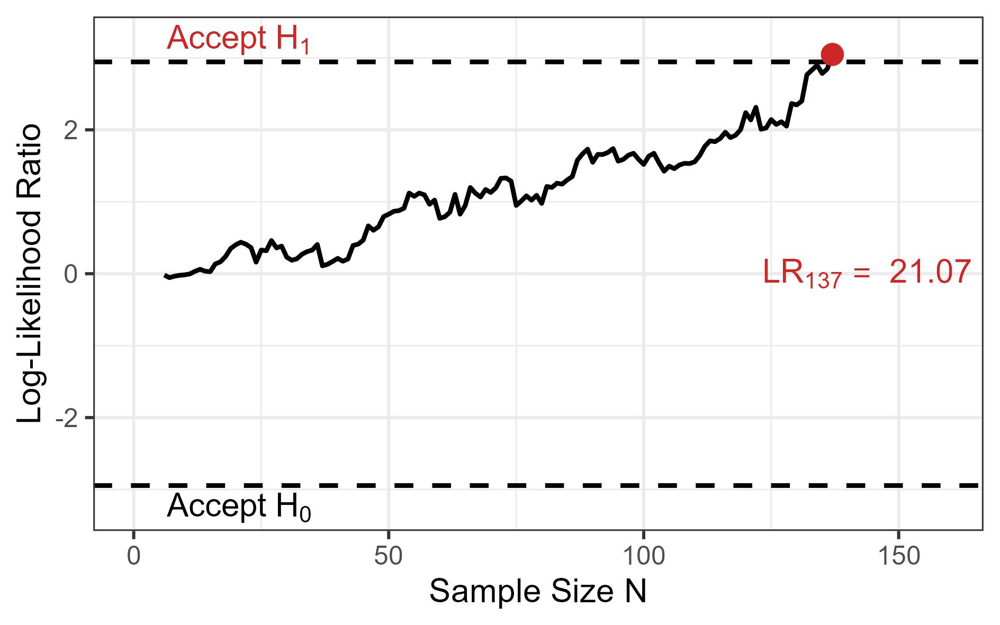

<!-- ATTENTION! see below -->

```{r setup, include=FALSE}
knitr::opts_chunk$set(
  echo = TRUE,
  collapse = TRUE,
  comment = "#>",
  # fig.path = "man/figures/README-",
  out.width = "100%"
)
options(tibble.print_min = 5, tibble.print_max = 5)
```

# sprtt

<!-- badges: start -->

[](https://cran.r-project.org/package=sprtt)
[](https://cran.r-project.org/package=sprtt)
[](https://cran.r-project.org/package=sprtt)
[](https://app.codecov.io/gh/MeikeSteinhilber/sprtt) [](https://github.com/MeikeSteinhilber/sprtt/actions/workflows/pkgdown-pak.yaml) [](https://github.com/MeikeSteinhilber/sprtt/actions/workflows/R-CMD-check-windows-macOs.yaml)


<!-- badges: end -->

## Overview

The `sprtt` package is a **s**equential **p**robability **r**atio **t**ests **t**oolbox (**sprtt**).

The package contains:

-   `seq_ttest()`, `seq_anova()` calculates sequential t-test and sequential one-way ANOVAs

-   `plot_anova()` plots results of sequential ANOVAs

-   `plan_sample_size()` creates comprehensive HTML reports with sample size recommendations based on pre-computed SPRT simulations

-   `draw_sample_normal()`, `draw_sample_mixture()` simulation of data sets

-   three data sets (`df_income`, `df_stress`, `df_cancer`) to run the examples in the t-test documentation


## Installation

### Release version from CRAN

This is the recommended version for a normal user.

```{r, eval = FALSE}
# installs the package
install.packages("sprtt")
```

### Development version from GitHub

To get a bug fix or to use a feature from the development version, you can install the latest version from GitHub.

```{r, eval=FALSE}
# the installation requires the "devtools" package
# install.packages("devtools")
# stable GitHub version
devtools::install_github("MeikeSteinhilber/sprtt")

# development version, may not be stable
devtools::install_github("MeikeSteinhilber/sprtt", ref="develop")
```

## Documentation

Detailed documentation can be found on the [home page](https://meikesteinhilber.github.io/sprtt/index.html). There are several articles covering the [usage](https://meikesteinhilber.github.io/sprtt/articles/usage-sprtt.html) of the package, the [theoretical background](https://meikesteinhilber.github.io/sprtt/articles/sequential_testing.html) of the test, and also an extended [use case](https://meikesteinhilber.github.io/sprtt/articles/use-case.html).

Short examples can be found in the following paragraph.

### Quick Examples

> **Note**
>
> In the R code sections:
>
> `# comment`: is a comment
>
> `function()`: is R code
>
> `#> results of function()`: is console output


<!--

ATTENTION!

in the .md file must be changed by hand. Otherwise the picture is not found on the website and CRAN.

-->

```{r, code=xfun::read_utf8('inst/examples/sprtt_examples.R')}

```


### Sample Size Planning

The sample size planning function requires simulation data (~70 MB).
On first use, this data will be downloaded and chached automatically:

```{r, eval=FALSE}
sprtt::plan_sample_size(f_expected = 0.25,
                        k_groups = 3,
                        power = 0.9,
                        decision_rate = 0.9)
```


The package contains functions to help managing the cached data, if necessary.

**Managing cached data**

```{r, eval=FALSE}
# Check cache status
sprtt::cache_info()

# Force re-download (if data was updated)
sprtt::download_sample_size_data(force = TRUE)

# Clear cache
sprtt::cache_clear()
```

If you need to use the package offline, download the data while connected beforehand.
