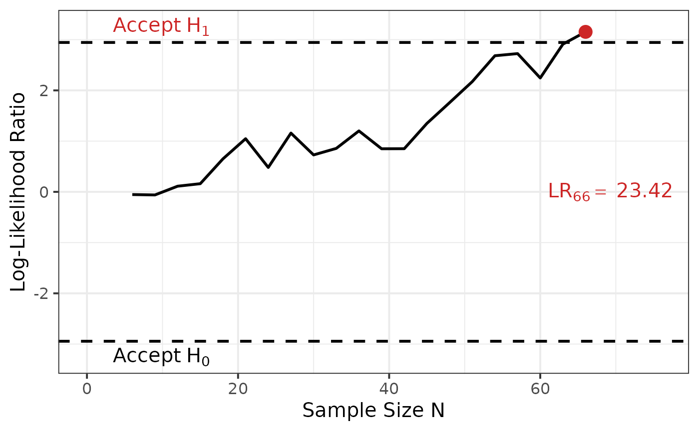
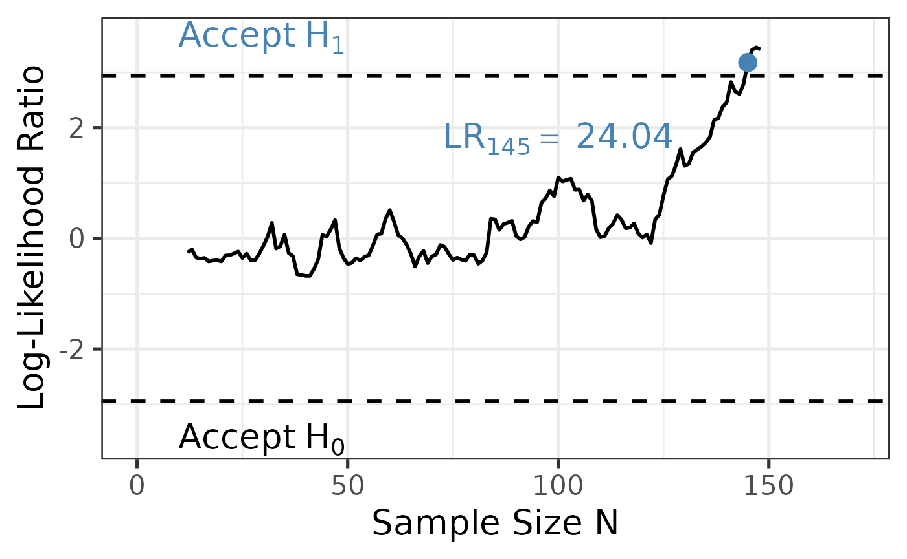

# Sequential One-Way ANOVA

## What is the sequential one-way ANOVA?

The sequential one-way fixed effects ANOVA is a sequential hypothesis
test based on the Sequential Probability Ratio Test (SPRT) framework
(Wald, 1947). It extends SPRTs to the comparison of two or more
independent groups and can be used as an efficient alternative to the
classical fixed-sample one-way ANOVA. For detailed information, see
Steinhilber et al. (2024). For a general introduction to SPRTs, see the
vignette
[`vignette("sprts")`](https://meikesteinhilber.github.io/sprtt/articles/sprts.md).

**Note:** The repeated measures ANOVA is not yet implemented in the
`sprtt` package.

## Sequential One-Way ANOVA

Analysis of variance (ANOVA) is widely used to compare means across
multiple groups. Traditional fixed-sample ANOVAs require an a priori
power analysis to determine the necessary sample size, which often
results in large samples, especially when expected effect sizes are
small (Steinhilber et al., 2024). Given the prevalence of small to
medium effects in psychology (Funder & Ozer, 2019; Richard et al.,
2003), many studies end up underpowered because the required sample
sizes exceed available resources (Button et al., 2013; Szucs &
Ioannidis, 2017).

The sequential one-way ANOVA provides an efficient alternative by
applying the SPRT framework to comparisons of \\k\\ groups. Instead of
collecting a fixed number of observations, data are collected
sequentially and the test evaluates evidence after each step until a
decision is reached (Steinhilber et al., 2024).

### Hypotheses

The sequential one-way ANOVA tests the following hypotheses, specified
in terms of Cohen’s \\f\\:

\\\begin{aligned} H_0 &: f = 0 \\ H_1 &: f = f\_{\text{exp}}, \quad
(f\_{\text{exp}} \> 0) \end{aligned}\\

Cohen’s \\f\\ is defined as:

\\f = \frac{\sigma_m}{\sigma}\\

where \\\sigma\\ is the common within-population standard deviation and
\\\hat{\sigma}\_m = \sqrt{\frac{\sum\_{i=1}^{k}(m_i - \bar{m})^2}{k}}\\,
with \\m_i\\ being the mean of group \\i\\ and \\\bar{m}\\ the overall
mean across all \\k\\ groups. In other words, \\f\\ captures the spread
of group means relative to the common within-group variability.

### The \\F\\ Statistic

At the \\n\\-th sequential step, the \\F\\ statistic is calculated from
\\k\\ groups with \\n\\ observations each (total \\N = k \cdot n\\, with
\\n, k \geq 2\\):

\\F_n = \frac{SS\_{\text{effect},n} / df_1}{SS\_{\text{residual},n} /
df\_{2,n}}\\

with

\\SS\_{\text{effect},n} = \sum\_{i=1}^{k} n(\bar{x}\_i - \bar{x})^2\\

\\SS\_{\text{residual},n} = \sum\_{i=1}^{k} \sum\_{j=1}^{n} (x\_{i,j} -
\bar{x}\_i)^2\\

\\df_1 = k - 1 \qquad \text{and} \qquad df\_{2,n} = N - k\\

where \\\bar{x}\\ is the overall mean, \\\bar{x}\_i\\ is the mean of
group \\i\\, and \\x\_{i,j}\\ is the \\j\\-th observation in group \\i\\
(Steinhilber et al., 2024; Wetherill & Glazebrook, 1986).

### The Likelihood Ratio

The likelihood ratio at step \\n\\ is defined as the ratio of the
likelihood under \\H_1\\ to the likelihood under \\H_0\\. Using Cox’s
theorem (Cox, 1952), it is sufficient to compute this ratio only for the
current \\F_n\\ statistic rather than the entire sequence of
observations:

\\\text{LR}\_n = \frac{f(F_n \mid df_1,\\ df\_{2,n},\\
\Delta\_{1n})}{f(F_n \mid df_1,\\ df\_{2,n})}\\

The numerator is the density of a **non-central** \\F\\ distribution
with non-centrality parameter \\\Delta\_{1n}\\, and the denominator is
the density of a **central** \\F\\ distribution (i.e., \\\Delta = 0\\
under \\H_0\\). The non-centrality parameter is linked to Cohen’s \\f\\
via:

\\\Delta_1 = f\_{\text{exp}}^2 \cdot N\\

### Decision Rule

The sequential ANOVA applies the standard SPRT decision boundaries:

- If \\\text{LR}\_n \geq A = \frac{1-\beta}{\alpha}\\: Stop and accept
  \\H_1\\
- If \\\text{LR}\_n \leq B = \frac{\beta}{1-\alpha}\\: Stop and accept
  \\H_0\\
- If \\B \< \text{LR}\_n \< A\\: Continue collecting data

### Efficiency and Robustness

Simulations with \\k = 4\\ groups demonstrate that the sequential ANOVA
is substantially more efficient than fixed-sample designs: in 87% of
cases the sequential sample was smaller than the fixed sample, with an
average sample size reduction of 58%. Efficiency gains are particularly
pronounced for small expected effect sizes (Steinhilber et al., 2024).

Robustness analyses showed that the sequential and fixed ANOVA behave
similarly under assumption violations. Both procedures are robust to
non-normal data (simulated using Gaussian mixture distributions) and to
mildly unequal variances or group sizes. The most critical scenario is a
combination of unbalanced group sizes and unequal variances,
specifically when smaller groups have larger variances—in this case,
\\\alpha\\ error rates can be inflated in both the sequential and the
fixed ANOVA.

As with all sequential procedures, effect size estimates from individual
sequential ANOVAs are conditionally biased (see Section “The
Bias-Efficiency Tradeoff”). However, the weighted average across studies
closely approximates the true population effect size (Steinhilber et
al., 2024).

The
[`seq_anova()`](https://meikesteinhilber.github.io/sprtt/reference/seq_anova.md)
function in the `sprtt` package implements the sequential one-way fixed
effects ANOVA described here.

## How to use `seq_anova()`

In the first step, we simulate data that we can analyze. In a real world
example we use the data that are coming in from the data collection.

``` r
set.seed(333)
# generate data with a medium effect -------------------------------------------
data <- sprtt::draw_sample_normal(
                k = 3,
                f = 0.25,
                max_n = 22)
```

We can calculate the sequential ANOVA for the first time, after we have
2 data points in each group.

``` r
# calculate the SPRT -----------------------------------------------------------
anova_results <- sprtt::seq_anova(
                          y~x,
                          f = 0.25,
                          data = data[1:6,],
                          verbose = FALSE)
anova_results
## 
## *****  Sequential ANOVA *****
## 
## formula: y ~ x
## test statistic:
##  log-likelihood ratio = -0.053, decision = continue sampling
## SPRT thresholds:
##  lower log(B) = -2.944, upper log(A) = 2.944

# access the decision ----------------------------------------------------------
anova_results@decision
## [1] "continue sampling"
```

The decision is, that we have to continue the data collection. In the
best case, we calculate the SPRT after each new data point.

Lets assume, we have now reached a later stage in the data collection –
in this scenario we have collected 20 data points.

``` r
# calculate the SPRT -----------------------------------------------------------
anova_results <- sprtt::seq_anova(
                          y~x,
                          f = 0.25,
                          data = data[1:20,],
                          verbose = FALSE)
anova_results
## 
## *****  Sequential ANOVA *****
## 
## formula: y ~ x
## test statistic:
##  log-likelihood ratio = 0.964, decision = continue sampling
## SPRT thresholds:
##  lower log(B) = -2.944, upper log(A) = 2.944

# access the decision ----------------------------------------------------------
anova_results@decision
## [1] "continue sampling"
```

We still got the decision to continue the data collection, so we do
that.

``` r
# calculate the SPRT -----------------------------------------------------------
anova_results <- sprtt::seq_anova(
                          y~x,
                          f = 0.25,
                          data = data,
                          verbose = TRUE)
anova_results
## 
## *****  Sequential ANOVA *****
## 
## formula: y ~ x
## test statistic:
##  log-likelihood ratio = 3.153, decision = accept H1
## SPRT thresholds:
##  lower log(B) = -2.944, upper log(A) = 2.944
## Log-Likelihood of the:
##  alternative hypothesis = -3.293
##  null hypothesis = -6.447
## alternative hypothesis: true difference in means is not equal to 0.
## specified effect size: Cohen's f = 0.25
## empirical Cohen's f = 0.4684039, 95% CI[0.1741801, 0.6969498]
## Cohen's f adjusted = 0.415
## degrees of freedom: df1 = 2, df2 = 63
## SS effect = 12.63455, SS residual = 57.58624, SS total = 70.22079
## *Note: to get access to the object of the results use the @ or [] instead of the $ operator.

# access the decision ----------------------------------------------------------
anova_results@decision
## [1] "accept H1"

# acess the LR -----------------------------------------------------------------
anova_results@likelihood_ratio
## [1] 23.41619
```

With a sample size of \$N = \$ 66, we now have reached the decision to
`anova_results@decision`. Thus, we stop the data collection.

## How to plot the ANOVA results

In order to plot the likelihood progression, we have to calculate all
the sequential steps that have happened before we reached the current
sample size. As this is only necessary for plotting and increases the
run time of the function, these calculations are only done, if the
function argument `plot=TRUE` is set.

### Scenario 1: Perfect data

In this case, we have data that are perfectly balanced and in a perfect
sampling order. Here, we can use the default value of the ‘plot’
argument ‘single’ or we can choose ‘balanced’. See the function
documentation of
[`seq_anova()`](https://meikesteinhilber.github.io/sprtt/reference/seq_anova.md)
for a description of each function argument

``` r
set.seed(333)
data <- sprtt::draw_sample_normal(3, f = 0.25, max_n = 22)

# calculate the SPRT -----------------------------------------------------------
anova_results <- sprtt::seq_anova(y~x, f = 0.25,
                                  data = data, plot = TRUE)
anova_results <- sprtt::seq_anova(y~x, f = 0.25,
                                  data = data, plot = TRUE,
                                  seq_steps = "single")
anova_results <- sprtt::seq_anova(y~x, f = 0.25,
                                  data = data, plot = TRUE,
                                  seq_steps = "balanced")

# plot the results -------------------------------------------------------------
sprtt::plot_anova(anova_results)
```



### Scenario 2: Unbalanced data in an imperfect order

In this case, we have a data set with unbalanced sample sizes between
the groups and the data points are not in a perfect order. Because the
order is not perfect, it does not make sense to use the ‘balanced’
option. Because the first data points (2\*k_groups) are not equally
distributed between the groups (some groups have less than 2 data
points), the option ‘single’ would output an error.

**Thus, we need to define the sequential steps ourselves.**

Here, we start later (after 12 data points) but then calculate the LR
after every single data point.

``` r
set.seed(333)
data <- sprtt::draw_sample_normal(3, f = 0.25, max_n = 37, sample_ratio = c(1,1,2))
data <- data[sample(nrow(data)),] # destroy the perfect order of the data

# calculate the SPRT -----------------------------------------------------------
anova_results <- sprtt::seq_anova(
                          y~x,
                          f = 0.25,
                          data = data,
                          plot = TRUE,
                          seq_steps = 12:nrow(data)) # we start with the first 12 data points instead of the first 6

# plot the results -------------------------------------------------------------
sprtt::plot_anova(anova_results,
                 labels = TRUE,
                 position_labels_x = 0.2,
                 position_labels_y = 0.2,
                 position_lr_x = 100,
                 position_lr_y = 1.8,
                 font_size = 20,
                 line_size = 1,
                 highlight_color = "steelblue"
                 )
```



## References

Button, K. S., Ioannidis, J. P. A., Mokrysz, C., Nosek, B. A., Flint,
J., Robinson, E. S. J., & Munafò, M. R. (2013). Power failure: Why small
sample size undermines the reliability of neuroscience. *Nature Reviews
Neuroscience*, *14*(5), 365–376. <https://doi.org/10.1038/nrn3475>

Cox, D. R. (1952). Sequential tests for composite hypotheses.
*Mathematical Proceedings of the Cambridge Philosophical Society*,
*48*(2), 290–299. <https://doi.org/10.1017/S030500410002764X>

Funder, D. C., & Ozer, D. J. (2019). Evaluating effect size in
psychological research: Sense and nonsense. *Advances in Methods and
Practices in Psychological Science*, *2*(2), 156–168.
<https://doi.org/10.1177/2515245919847202>

Richard, F. D., Bond, C. F., & Stokes-Zoota, J. J. (2003). One hundred
years of social psychology quantitatively described. *Review of General
Psychology*, *7*(4), 331–363.
<https://doi.org/10.1037/1089-2680.7.4.331>

Steinhilber, M., Schnuerch, M., & Schubert, A.-L. (2024). Sequential
analysis of variance: Increasing efficiency of hypothesis testing.
*Psychological Methods*. <https://doi.org/10.1037/met0000677>

Szucs, D., & Ioannidis, J. P. A. (2017). When null hypothesis
significance testing is unsuitable for research: A reassessment.
*Frontiers in Human Neuroscience*, *11*, 390.
<https://doi.org/10.3389/fnhum.2017.00390>

Wald, A. (1947). *Sequential analysis*. Wiley.

Wetherill, G. B., & Glazebrook, K. D. (1986). *Sequential methods in
statistics* (3rd ed). Chapman and Hall.
