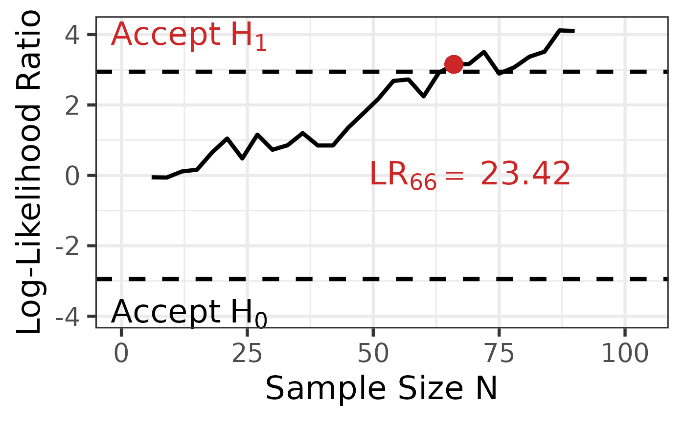
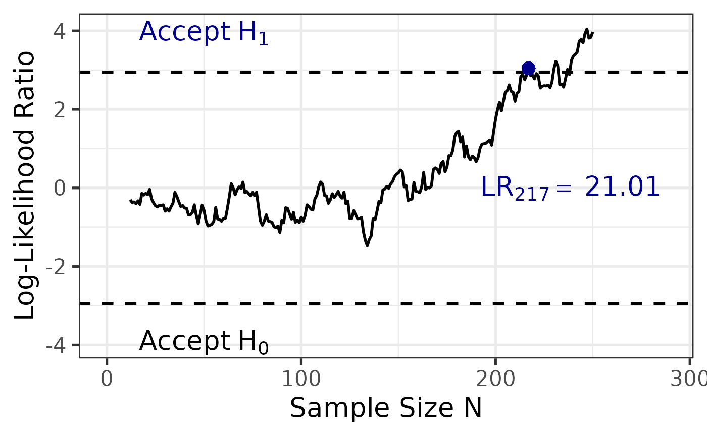

# Sequential One-Way ANOVA

## Overview

The `sprtt` package is a **s**equential **p**robability **r**atio
**t**ests **t**oolbox (**sprtt**). This vignette describes the
theoretical background of these tests.

Other recommended vignettes cover:

- a [general
  guide](https://meikesteinhilber.github.io/sprtt/articles/usage-sprtt.html),
  how to use the package and

- an extended [use
  case](https://meikesteinhilber.github.io/sprtt/articles/use-case.html).

## What is a sequential test procedure?

With a sequential approach, data is continuously collected and an
analysis is performed after each data point, which can lead to three
different results (A. Wald, 1945):

- The data collection is *terminated* because enough evidence has been
  collected for the null hypothesis (H₀).

- The data collection is *terminated* because enough evidence has been
  collected for the alternative hypothesis (H₁).

- The data collection *will continue* as there is not yet enough
  evidence for either of the two hypotheses.

Basically it is not necessary to perform an analysis after each data
point — several data points can also be added at once. However, this
affects the sample size (N) and the error rates (Schnuerch et al.,
2020).

The efficiency of sequential designs has already been examined.
Reductions in the sample by 50% and more were found in comparison to
analyses with fixed sample sizes (Schnuerch et al., 2020; A. Wald,
1945). Sequential hypothesis testing is therefore particularly suitable
when resources are limited because the required sample size is reduced
without compromising predefined error probabilities.

## What is the sequential one-way ANOVA?

The sequential one-way fixed effects ANOVA is based on the Sequential
Probability Ratio Test (SPRT) by Abraham Abraham Wald (1947), which is a
highly efficient sequential hypothesis test. It can be used instead of
*t*-tests if the means of two or more groups are compared. For detailed
information see the public preprint (Steinhilber et al., 2023). Note:
keep in mind that the repeated measurement ANOVA is not implemented yet
in the sprtt package.

## How to plot the ANOVA results

### Scenario 1: Perfect data

In this case, we have data that are perfectly balanced and in a perfect
sampling order. Here, we can use the default value of the ‘plot’
argument ‘single’ or we can choose ‘balanced’.

``` r
set.seed(333)
data <- sprtt::draw_sample_normal(3, f = 0.25, max_n = 30)

# calculate the SPRT -----------------------------------------------------------
anova_results <- sprtt::seq_anova(y~x, f = 0.25, data = data, plot = TRUE)
anova_results <- sprtt::seq_anova(y~x, f = 0.25, data = data, plot = TRUE, seq_steps = "single")
anova_results <- sprtt::seq_anova(y~x, f = 0.25, data = data, plot = TRUE, seq_steps = "balanced")

# plot the results -------------------------------------------------------------
sprtt::plot_anova(anova_results)
## Warning in geom_point(aes(x = .data$sample_size[decision_sample_position], : All aesthetics have length 1, but the data has 29 rows.
## ℹ Please consider using `annotate()` or provide this layer with data containing
##   a single row.
```



### Scenario 2: Unbalanced data in an imperfect order

In this case, we have a data set with unbalanced sample sizes between
the groups and the data points are not in a perfect order. Because the
order is not perfect, it does not make sense to use the ‘balanced’
option. Because the first data points (2\*k_groups) are not equally
distributed between the groups (some groups have less than 2 data
points), the option ‘single’ would output an error.

**Thus, we need to define the sequential steps ourselves.**

Here, we start later (after 12 data points) but then calculate the LR
after every single data point.

``` r
set.seed(333)
data <- sprtt::draw_sample_normal(3, f = 0.25, max_n = 50, sample_ratio = c(1,2,2))
data <- data[sample(nrow(data)),] # destroy the perfect order of the data

# calculate the SPRT -----------------------------------------------------------
anova_results <- sprtt::seq_anova(y~x, f = 0.25, data = data,
                                  plot = TRUE,
                                  seq_steps = 12:nrow(data) # we start with the first 12 data points instead of the first 6
                                  )

# plot the results -------------------------------------------------------------
sprtt::plot_anova(anova_results,
                 labels = TRUE,
                 position_labels_x = 0.2,
                 position_labels_y = 0.2,
                 position_lr_x = 0.1,
                 position_lr_y = -1.8,
                 font_size = 20,
                 line_size = 1,
                 highlight_color = "darkblue"
                 )
## Warning in geom_point(aes(x = .data$sample_size[decision_sample_position], : All aesthetics have length 1, but the data has 239 rows.
## ℹ Please consider using `annotate()` or provide this layer with data containing
##   a single row.
```



## References

Schnuerch, M., Erdfelder, E., & Heck, D. W. (2020). Sequential
hypothesis tests for multinomial processing tree models. *Journal of
Mathematical Psychology*, *95*, 102326.
<https://doi.org/10.1016/j.jmp.2020.102326>

Steinhilber, M., Schnuerch, M., & Schubert, A.-L. (2023). Sequential
one-way ANOVA: Increasing efficiency in psychological hypothesis testing
using a variant of sequential probability ratio tests. *PsyArXiv*.
<https://doi.org/10.31234/osf.io/m64ne>

Wald, A. (1945). Sequential tests of statistical hypotheses. *The Annals
of Mathematical Statistics*, *16*(2), 117–186.

Wald, Abraham. (1947). *Sequential analysis*. Wiley.
